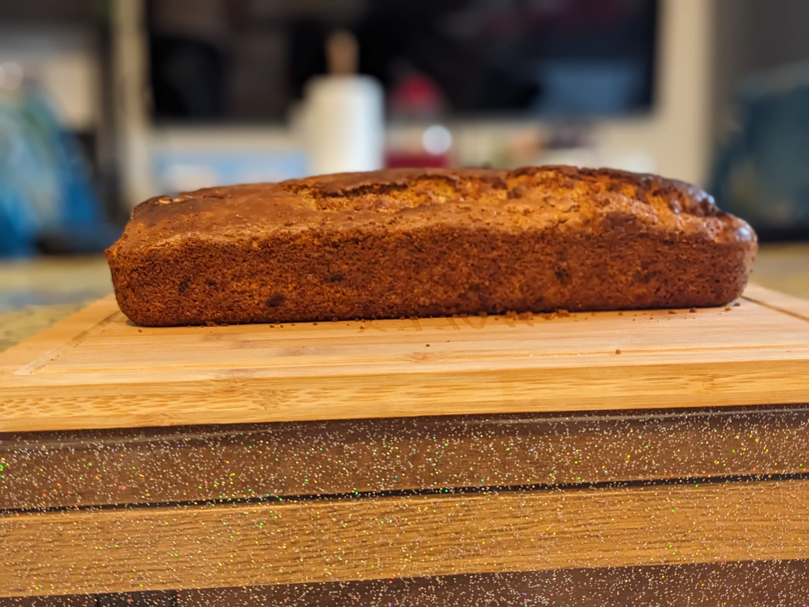

+++
date = '2025-03-10T21:59:39Z'
draft = false
title = 'Banana Bread🍌🍞'
tags = ["food"]
+++

## Ingredients

- 2 bananas
- 2 eggs
- 2 cups of flour
- 2 tsp baking powder
- 2 tsp cinnnamon
- 1 cup brown sugar/ white sugar
- 1 cup oil

## Steps
1. Mash your bananas 🍌
2. Next mashing your bananas add yout eggs 🥚
3. After mixng, measure and add your flour,baking powder, cinnamon and brown sugar 🍬
4. Then, add your oil!
5. Finally pre-heat your oven for 5 minutes 🔥

## Time⌚️/Heat🔥

After the time pre-heating your oven set the time to 180C/ 356F cook it for 1 hour.

